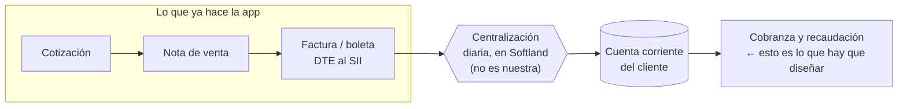

# Consulta a un ingeniero de procesos — cómo llevar la cobranza y la recaudación

> Petición de ayuda al diseño del flujo. Lo técnico está medido contra la base de
> producción el 2026-09-26; lo que no está medido se dice que no lo está.
>
> Lo que **no** se pide: ayuda con la programación. Lo que se pide es el
> **proceso**: qué hitos tiene una cobranza, quién los mueve, qué se puede hacer
> en terreno y sin señal, y sobre todo **dónde está la raya** entre lo que la app
> puede escribir y lo que le corresponde al ERP.

## 1. En una frase

Tenemos una app Android que ya lleva el ciclo comercial completo —cotización,
nota de venta, factura y boleta electrónica enviadas al SII— y queremos
extenderla a **cobranza y recaudación**: que el vendedor en terreno pueda ver
qué le deben, gestionar el cobro y recibir el pago. Necesitamos que alguien que
entienda de procesos nos diga **cómo debería ser ese flujo** antes de que
escribamos una línea.

## 2. El negocio, en hechos medidos

1. **Se factura por suscripción.** Una nota de venta genera **varias facturas a
   lo largo de meses**. No existe la relación «una venta, una factura».
2. **Se opera como distribuidor.** De 192 facturas enlazadas a una nota de venta,
   **190 se emiten a un tercero** —188 al mandante— con una sola línea de
   comisión, en lugar de al cliente que recibió los productos.
3. **Pero la cobranza no sigue ese hilo.** Esto nos lo aclaró el dueño del
   proceso y es importante: la cobranza **no reconstruye** el camino cotización →
   nota de venta → factura. Se para en el cliente y mira **su cuenta corriente**:
   da igual si sus facturas vienen del ciclo completo o si son facturas sueltas.
   Lo que sí hace falta es **el listado de sus documentos, para elegir cuáles se
   pagan**.
4. **La cobranza nunca es el mismo día.** Se vende, se entrega, y se paga a 30
   días o la semana siguiente. Cuando llega el momento de cobrar, el documento
   ya pasó a contabilidad.
5. **El vendedor va a recibir dinero en terreno**, y de tres formas:
   **efectivo**, **cheque** y **comprobante de transferencia ya confirmada**. Los
   tres se parecen en la pantalla y no se parecen en nada más: el efectivo es
   valor que queda en el bolsillo de una persona, el cheque es una promesa que
   puede protestarse, y la transferencia es dinero que ya está en el banco pero de
   la que el vendedor sólo recibe **evidencia**. Eso mete custodia y rendición en
   el flujo.
6. **El universo real hoy es pequeño**: la cuenta corriente de clientes tiene
   **432 movimientos, 6 clientes con movimiento y un saldo de 4.391.820**. El
   padrón de clientes, en cambio, tiene 2.674. Es decir: esto va a crecer, y el
   diseño no puede asumir el tamaño de hoy.

## 3. Cómo funciona hoy, y por qué importa la contabilidad

En Softland las facturas y boletas se generan en el módulo de **inventario y
facturación** (o en punto de venta). **Mientras no pasen a contabilidad no se
puede cobrar**: es la *centralización*, un procedimiento que la empresa corre
**a diario** y al que los usuarios de Softland están perfectamente habituados.
No es un obstáculo ni algo que queramos cambiar: es la precondición, tiene dueño
y tiene ritmo.

Está medido que funciona y está al día: hay movimientos de cuenta corriente
hasta el folio 239, con fecha de ayer.

**Consecuencia de diseño que ya damos por buena**: una factura recién emitida
**no es cobrable todavía**, y eso no es un error, es el estado normal de las
primeras horas. La app lo va a **decir** —«emitida, aún no centralizada»— en vez
de mostrar un saldo que no cuadra.

## 4. El terreno técnico

Todo lo de esta sección está verificado con consultas de sólo lectura sobre la
base de producción.

### La cuenta corriente

Vive en **`cwmovim`** (1.286 filas), que son las **líneas de los comprobantes
contables**: clave primaria `(CpbAno, CpbNum, MovNum)`. La cuenta corriente de
clientes es la cuenta **`1-01-03-001` «Cuenta Corriente Cliente»** del plan de
cuentas, con 432 movimientos, 140.085.867 al debe y 135.694.047 al haber.

El saldo de un cliente **no está guardado en ninguna parte**: es
`SUM(MovDebe) - SUM(MovHaber)` sobre esa cuenta, agrupado por auxiliar. Igual que
en el resto del sistema, el saldo es una resta sobre lo que existe ahora.

Columnas que importan:

| Columna | Qué es |
|---|---|
| `CodAux` | El cliente (auxiliar). Es la llave del deudor |
| `PctCod` | La cuenta contable. Distingue clientes de proveedores |
| `TtdCod`, `NumDoc` | Tipo y número del documento que genera el movimiento |
| `MovFe`, `MovFv` | Fecha de emisión y **fecha de vencimiento** |
| `MovDebe`, `MovHaber` | Lo que suma y lo que resta a la deuda |
| `MovTipDocRef`, `MovNumDocRef` | **A qué documento se aplica** este movimiento |
| `Cuota`, `CuotaRef` | Cuotas, cuando la condición de venta las genera |
| `FecPag`, `CODCPAG`, `FormadePag` | Cuándo y cómo se pagó |
| `CodBanco`, `CodCtaCte`, `MovNC`, `fecEmisionch`, `paguesea` | Datos del cheque |
| `CajCod`, `VendCod`, `MonCod`, `MovEquiv` | Caja, vendedor, moneda |
| `MovGlosa` | Texto; hoy trae `EL-239-SOFTLAND INGENERIA LIMITADA` |

### Los tipos de documento que aparecen

| `TtdCod` | Filas | Debe | Haber | Qué parece ser |
|---|---|---|---|---|
| `EL` | 225 | 140.085.867 | 0 | Factura electrónica de venta |
| `TR` | 194 | 300.000 | 126.890.188 | Pagos / transferencias |
| `FT` | 158 | 6.653.685 | 277.452.019 | Factura de compra (proveedor) |
| `NL` | 12 | 0 | 8.037.723 | Nota de crédito electrónica |
| `RE` | 5 | 0 | 379.618 | Rendición |
| `NT`, `FL` | 3, 6 | | | |

### El enlace con nuestra factura — comprobado

`cwmovim.NumDoc` con `TtdCod = 'EL'` calza con `iw_gsaen.Folio` con
`Tipo = 'F'` en **225 de 225** casos. (Ojo al detalle que nos costó un rato: el
`Tipo` de `iw_gsaen` es `F`, no el código `33` del SII.)

Y el movimiento de la factura **se referencia a sí mismo**
(`MovTipDocRef = 'EL'`, `MovNumDocRef` = su folio): la referencia identifica **la
deuda**, y los pagos apuntan con ella al documento que abonan. Verificado con un
caso real de rendición: un documento `RE` y su movimiento `TR` apuntando al
mismo número.

### La bitácora de la centralización

**`iw_logcontab`** (234 filas) enlaza cada documento con su comprobante:
`TipoDoc` + `Folio` → `CpbAno` + `CpbNum`, con `esAutomatica`, `Contabilizado` y
`Observacion`. Es la forma limpia de contestar «¿está ya centralizada esta
factura?» sin adivinar.

### El perfil de cobranza del cliente

**`cwtcvcl`** (2.674 filas, una por cliente) ya tiene los campos que una
cobranza necesita: condición de venta, **monto de crédito**, **código de
cobrador**, **dirección y teléfono de cobranza**, **día de pago**, zona, canal y
categoría. Existe también el maestro de cobradores, `cwtcobr`.

### Softland ya trae un módulo de cobranza, y está vacío

Esto lo encontramos al final y cambia la pregunta de fondo. El módulo de
tesorería y cobranza del ERP (tablas `xw*`) **tiene las tablas que este proyecto
necesitaría, y no tienen ni una fila**:

| Tabla | Filas | Qué es |
|---|---|---|
| `xwcobranza` | **0** | La bitácora de cobranza: fecha, hora, cliente, **`conversa`** (el texto de la conversación), cobrador y contacto |
| `xwttcomp` | 2 | Tipos de **compromiso de cobranza** — el equivalente al maestro que ya usamos en cotizaciones |
| `xwcabco`, `xwdetco` | 0, 0 | Cabecera y detalle de cobranza |
| `xwseguimiento` | 0 | Seguimiento |
| `xwarqueo`, `xwarqueo_det` | 0, 0 | **Arqueo de caja** |
| `xwtbanco` | 45 | Bancos (sí poblado) |
| `xwestraux` | 34 | Estados del auxiliar (sí poblado) |
| `xwtfpago` | 5 | **Formas de pago** (sí poblado, ver abajo) |

O sea: el ERP ya modela «quién llamó a quién, cuándo y qué dijo», el compromiso
de pago y el arqueo de caja. Nadie lo usa.

### Las formas de pago que la empresa declara

`xwtfpago` mapea cada forma de pago a una **cuenta contable**, que es justo lo que
una recaudación necesita para saber dónde entra el dinero:

| Código | Descripción | Cuenta | Es efectivo |
|---|---|---|---|
| 1 | EFECTIVO | `1-01-01-001` | sí |
| 2 | CHEQUE 30 DIAS | `1-01-02-002` | no |
| 3 | CHEQUE AL DIA | `1-01-02-002` | no |
| 4 | TARJETA DEBITO | `1-01-04-002` | no |
| 5 | Pago en LInea | `1-01-02-003` | no |

**No hay «transferencia».** Y es uno de los tres instrumentos que el vendedor va
a traer. Lo más parecido es «Pago en Línea», que no es lo mismo. Nosotros no
inventamos códigos de maestro —es una regla de este proyecto—, así que eso hay
que decidirlo y darlo de alta.

### Cómo se cobran hoy las facturas, de hecho

Los pagos existen como movimientos `TR` metidos **a mano en un solo comprobante**:
el `00009000`, con el mismo número de documento (14926) para varios movimientos y
la glosa `F 233`, `F 234`… Cada uno referencia su factura, y ninguno lleva caja,
forma de pago ni instrumento. Es decir: **hoy no hay flujo de recaudación; hay un
asiento contable escrito a mano después de que el dinero llegó**.

## 5. Tres hallazgos incómodos que cambian el diseño

Los ponemos por delante porque si el proceso se diseña sin saberlos, se diseña
para una realidad que no es la de esta empresa.

**1. Casi no hay plazos registrados.** De los 225 movimientos de factura,
**223 tienen vencimiento igual a la fecha de emisión** — es decir, contado. Sólo
2 tienen plazo, y el mayor es de 30 días. Pero el negocio **sí vende a 30 días**.
O sea: **el plazo real no está llegando a la base**. Tal como está hoy, «vencido»
significa simplemente «emitido y no pagado», y eso hace que el 100 % de la deuda
figure vencida, que es una señal inútil para priorizar.

**2. Los campos de cobranza están vacíos.** De los 2.674 clientes: 4 tienen
cobrador asignado, 11 tienen monto de crédito, **4** tienen día de pago y
**ninguno** tiene dirección de cobranza. La condición de venta sí está puesta en
2.609, casi toda con dos códigos («2» en 2.178 y «1» en 426).

**3. El instrumento de pago nunca se registra.** De los 1.286 movimientos de
`cwmovim`: **0** con forma de pago, **0** con banco, **0** con cuenta corriente,
**0** con número de cheque, **0** con número de operación. Las columnas existen
todas —el ERP las tiene— y están vacías. Sólo la caja (`CajCod`) va poblada en
los 1.286, y con un valor genérico.

Así que parte de lo que hay que diseñar no es software, es **qué datos hay que
empezar a capturar, quién los captura y en qué momento del flujo**.

## 6. Lo que ya está construido y se puede reutilizar

No queremos inventar lo que ya existe y funciona:

- **Compromiso = un verbo y una fecha.** Ya lo usamos en las cotizaciones, con el
  maestro del ERP. Una lección aprendida que valdría igual para la cobranza:
  mezclar el compromiso con el «grado de avance» hace que una venta al 90 %
  parezca retroceder al acordar una llamada. Son dos ejes distintos.
- **«Sin próximo paso»** como filtro y como cifra del panel.
- **Ir al calendario por una intención de Android**, sin permisos y sin señal.
- **Bandeja de salida** para todo lo que se escribe sin red, con idempotencia.
- **Motor de documentos** en PDF y notificaciones con reglas configurables.
- **Alcance por vendedor** —que es permiso y no se levanta— y ventana de 12 meses.

## 7. Lo que te pedimos que decidas

### A0. La pregunta de fondo, ahora que sabemos que el módulo existe
0. **¿Conducimos el módulo de cobranza de Softland desde el teléfono, o llevamos
   la gestión en nuestro propio esquema y sólo le entregamos al ERP la parte del
   dinero?** Nos importa mucho y no es una decisión técnica: si la gestión vive en
   nuestras tablas, el Softland de escritorio no la ve, y tendríamos **dos
   verdades sobre lo mismo** — que es el error que este proyecto evita en todo lo
   demás (por eso el código de barras se guarda en la columna del ERP y no en una
   tabla nuestra). Pero si el módulo está vacío porque no está licenciado, o
   porque su flujo no sirve para un vendedor en terreno, forzarlo es peor.

### A. El objeto y sus hitos
1. ¿Cuál es la unidad de cobranza: el documento, el vencimiento (cuota) o el
   cliente? Si un documento se paga en dos veces, ¿qué se está cerrando?
2. ¿Qué hitos debería tener, y cuáles son observables en la base y cuáles habría
   que inventar? Nuestra lista tentativa: emitida → centralizada → por vencer →
   vencida → en gestión → con compromiso de pago → pagada / pagada en parte →
   irrecuperable.
3. ¿Qué se hace con lo emitido y **no centralizado todavía**: se esconde, se
   muestra aparte, o se muestra con aviso?

### B. El plazo
4. Dado el hallazgo 5.1: ¿de dónde debería salir el vencimiento — de la condición
   de venta del cliente, de la del documento, escrito a mano al facturar? ¿Quién
   es el responsable de que sea correcto?
5. ¿Hay que soportar cuotas de verdad (varios vencimientos por factura) desde el
   principio, o basta un vencimiento por documento?

### C. La recaudación — la pregunta grande
6. **¿La app aplica el pago o sólo lo propone?** Aplicar un pago es un acto
   contable: escribe en la cuenta corriente y, si se hace mal, hay que corregirlo
   con contabilidad y no con un `UPDATE`. Las opciones que vemos: (a) la app sólo
   registra una **intención** y la aplicación la hace una persona en Softland;
   (b) la app escribe el documento de recaudación y la centralización lo recoge
   como cualquier otro; (c) la app escribe directo en la cuenta corriente.
   Nuestra intuición es (a) o (b), pero la decisión es de proceso, no de gusto.
7. Si la app recibe pagos: ¿contra qué documento se aplican cuando el cliente
   paga «una cantidad» sin decir qué factura cubre? ¿Hay regla (más antigua
   primero), o lo elige quien cobra? — El dueño del proceso ya nos dijo que el
   listado de facturas para **elegir cuáles se pagan** es obligatorio.
8. ¿Qué pasa con anticipos y con saldos a favor?

### D. Dinero en terreno — esto ya está contestado, y es lo que más nos preocupa

El vendedor **va a recibir efectivo, cheques y comprobantes de transferencia
confirmada**. Los tres, en terreno. De ahí salen estas preguntas:

9. **¿Qué significa «pagado» en cada instrumento?** Un cheque a 30 días no es
   dinero: puede protestarse, y hasta que se cobra la deuda sigue viva de otra
   forma. Una transferencia que el vendedor **ve confirmada en el teléfono del
   cliente** tampoco es dinero comprobado por nosotros. ¿El saldo baja al recibir,
   al depositar, o al conciliar con el banco? Son tres momentos distintos y el
   cliente va a creer que pagó en el primero.
10. **¿Qué se le entrega al cliente en el momento?** Si es un recibo numerado,
    ¿quién reparte esos números, y qué pasa **sin señal**? Es el mismo problema
    del folio del DTE, que resolvimos no dejando que el teléfono elija número —
    pero aquí el cliente se va con un papel en la mano.
11. **Custodia y rendición**: ¿cada cuánto rinde el vendedor, contra quién, y qué
    pasa con una diferencia de caja? El ERP tiene `xwarqueo` para el arqueo y
    vimos un caso real de rendición funcionando con documentos `RE`.
12. **El cheque tiene datos propios** —banco, cuenta, número, fecha de cobro,
    «páguese a»— y el ERP tiene columnas para todos. ¿Se capturan a mano, se
    fotografía el cheque, o las dos cosas? ¿Y el comprobante de transferencia, se
    adjunta la imagen?
13. ¿Quién cobra: el vendedor que vendió, un cobrador del maestro `cwtcobr`, o
    administración desde la oficina? Hoy hay 4 clientes con cobrador asignado, o
    sea que el campo existe pero el rol no se usa.

### E. Lo que resta deuda sin ser un pago
14. ¿Cómo entran las notas de crédito en el saldo por cobrar? (La app hoy sólo
    emite notas de crédito de **anulación completa**.)
15. ¿Y los castigos, las condonaciones y los descuentos por pronto pago?

### F. Lo legal
16. ¿Cómo debería entrar la ley 19.983 —acuse de recibo, mérito ejecutivo— en el
    proceso? El acuse del cliente es lo que hace exigible una factura, y hoy no lo
    estamos siguiendo en ninguna parte.

### G. Qué se mira
17. ¿Qué tiene que ver quien cobra al abrir la app, en orden? ¿Y quien dirige?
18. ¿Cuál es la cifra que manda: deuda total, deuda vencida, o el tramo de
    antigüedad? ¿Con qué tramos?

## 8. Restricciones que el diseño tiene que respetar

1. **La contabilidad es de Softland.** La app no escribe comprobantes. La
   centralización sigue siendo un procedimiento de la empresa, a diario.
2. **Sin señal tiene que funcionar.** Y un saldo leído sin red es **una foto con
   hora**: el dinero se mueve sin el teléfono delante, y mostrar un saldo viejo
   como actual es un vendedor cobrando algo ya pagado.
3. **Nada se escribe sin ser idempotente.** Reenviar una recaudación desde un
   teléfono que perdió la respuesta no puede cobrar dos veces. Y un pago, como un
   folio, **no se deshace**: se anula, no se borra.
4. **Un repositorio, N instalaciones.** Nada puede depender de esta empresa en
   particular: lo suyo va en configuración, no en el código.
5. **La app no inventa códigos.** Cobradores, condiciones de venta y formas de
   pago se leen de los maestros del ERP; si un maestro está vacío, se dice.

## 9. Lo que todavía no sabemos, y lo decimos

- **Qué significan las condiciones de venta «1» y «2»**, que cubren 2.604 de los
  2.609 clientes que tienen una puesta. No dimos con el maestro que las declara.
- **Por qué el módulo de cobranza del ERP está vacío**: si no está licenciado,
  si su flujo no sirve para terreno, o si simplemente nadie lo puso en marcha.
  La respuesta decide la pregunta 0, que es la más importante de esta lista.
- **Cómo se usan las tablas de caja y de arqueo** (`vw_tcaja`, `xwarqueo`,
  `Rendicion_Cuenta_rendicion`). Vimos un caso real de rendición, pero no el
  procedimiento completo.
- **Por qué el plazo de venta no llega a la base** (hallazgo 5.1): si es un dato
  que nadie rellena, un parámetro mal puesto o un paso del proceso que no se hace.
- **Si hay cobranza ocurriendo hoy fuera del ERP** —en una planilla, por
  ejemplo—, porque entonces el proceso ya existe y lo que hay que hacer es
  recogerlo, no diseñarlo de cero.
