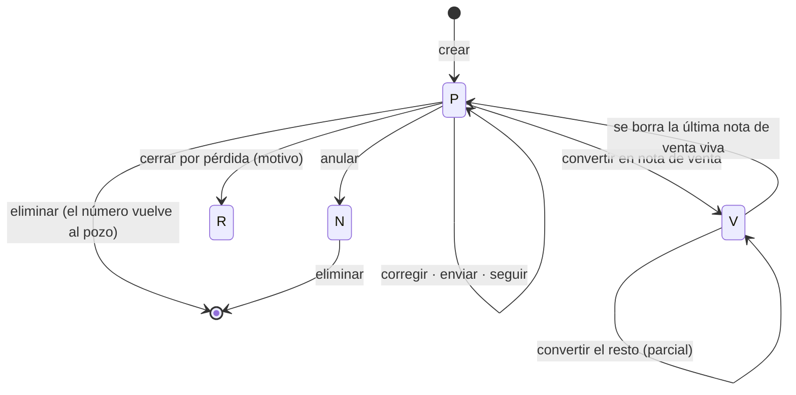

# Cotizaciones y seguimiento — informe funcional

> Informe de traspaso para un técnico de programación que se incorpora al
> proyecto. Describe **qué hace el sistema y por qué**, no cómo está escrito:
> no hay código. Las referencias a archivos son para que sepa dónde mirar
> después.
>
> Estado a la versión 0.49.2. Datos medidos contra la base real de INNOVAGES.

## 1. De qué va esto

Venta Softland es una app Android para vendedores en terreno que trabaja
**sobre la base de un ERP ajeno** (Softland) y **sin señal**. La cotización es
el primer documento del ciclo:

```
cotización ──► nota de venta ──► factura / boleta electrónica
```

Este informe cubre sólo el primer tramo: el ciclo de vida de la cotización y el
seguimiento comercial que cuelga de ella.

Hay dos ideas que conviene tener claras antes de leer nada más:

1. **La app no es dueña de los datos.** La cotización vive en las tablas
   nativas de Softland, que el ERP de escritorio sigue leyendo y escribiendo al
   mismo tiempo. Todo lo que la app añade por su cuenta vive en un esquema
   aparte (`ventas`), y **ninguna clave foránea cruza** entre los dos esquemas.
2. **El teléfono es el que manda el ritmo.** Baja los datos a una base local,
   trabaja contra ella y sincroniza cuando puede. El servidor no recuerda qué
   bajó quién.

## 2. Dónde vive cada cosa

| Pieza | Dónde | Qué resuelve |
|---|---|---|
| Endpoints de cotización | `app/Http/Controllers/Api/CotizacionController.php` | Validación, permisos, respuestas |
| Comportamiento común de documentos | `app/Http/Controllers/Api/DocumentoController.php` | Anular, eliminar, enviar, compartir |
| Escritura en Softland | `app/Services/Softland/Ventas.php` | Transacciones, correlativos, seguimiento |
| Reglas de seguimiento de la empresa | `app/Services/Softland/ReglasSeguimiento.php` | Qué compromisos se ofrecen, escalera de avance |
| Catálogo de maestros que baja el teléfono | `app/Services/Softland/Maestros.php` | Tabla, clave, campos, filtro y alcance |
| Saldo por convertir | `app/Services/Softland/Saldo.php` | Cuánto queda de cada línea |
| Regla de compromisos (teléfono) | `mobile/src/seguimiento.js` | Atrasado / hoy / próximo / sin próximo paso |
| Regla de vigencia (teléfono) | `mobile/src/panel/metricas.js` | Abierta / por vencer / vencida |
| Ficha del documento | `mobile/src/views/Documento.vue` | Acciones sobre una cotización |
| Lista y filtros | `mobile/src/views/Documentos.vue` | Bandeja de trabajo del vendedor |
| Bandeja de salida sin señal | `mobile/src/pendientes.js` | Lo escrito offline |

## 3. El modelo de datos

### En Softland (esquema `softland`, no `dbo`)

| Tabla | Qué guarda | Clave |
|---|---|---|
| `nwcotiza` | Cabecera de la cotización, 50 columnas | `CotNum` |
| `nwdetcot` | Líneas | `CotNum` + `CtLinea` |
| `NWCtImpto` | Impuestos de la cotización | `CotNum` |
| `nwtsegui` | Anotaciones de seguimiento | `CotNum` + `NroSeg` |
| `nwttcomp` | Maestro de tipos de compromiso | `codcomp` |
| `nwperdida` | Maestro de motivos de pérdida | `CodPerd` |
| `nw_lognwcotiza` | Bitácora del ERP | — |

Las columnas de cabecera que importan: cliente (`CodAux`), contacto por nombre
(`NomCon`), vendedor (`VenCod`), moneda, lista de precios, condición de venta,
centro de costo, estado (`CtEstado`), fechas de emisión y entrega, motivo de
pérdida y sus totales. Hay cinco niveles de descuento, en monto y en
porcentaje, tanto en cabecera como en línea.

### En el esquema propio de la app (`ventas`)

| Tabla | Para qué |
|---|---|
| `documento_app` | Mapa `client_uuid` → número de documento. Es la idempotencia |
| `cotizacion_avance` | El % de avance comercial, con historia |
| `documento_emision` | Cada versión entregada al cliente y por dónde salió |
| `linea_origen` | Qué línea de cotización originó qué línea de nota de venta |
| `config` | Reglas por empresa, entre ellas las de seguimiento |

**Detalle que se olvida y causa errores raros:** el número de cotización no es
autoincremental. Se calcula como «máximo + 1» dentro de la transacción, y
Softland permite **borrar** cotizaciones (hay 4.453 huecos en la numeración de
INNOVAGES). Por eso un número **puede volver a repartirse**. Todas las tablas
de la app que apuntan a un documento guardan también su instante de nacimiento
(`FechaHoraCreacion`) y **comparan las dos cosas**: si no coinciden, la fila
está muerta y se ignora. Sin eso, un documento nuevo heredaba el historial de
entregas, el avance y las referencias del que tuvo ese número antes.

## 4. Ciclo de vida de la cotización

Cuatro estados en `CtEstado`, y no hay más. Son el vocabulario del ERP, no una
lectura de los datos:

| Estado | Significado | Filas en INNOVAGES |
|---|---|---|
| `P` | Pendiente. Con este nace | 189 |
| `V` | Tiene nota de venta | 679 |
| `R` | Perdida, con motivo | 482 |
| `N` | **Nula** (anulada) | 1.000 |

> **`N` es «nula», no «nueva».** Es el error que costó tres meses de documentos
> invisibles: la app nacía las cotizaciones en `N` porque era el estado más
> frecuente. Un documento anulado no aparece en las ventanas de búsqueda del
> ERP.



### Crear

El teléfono manda el documento completo con un identificador propio
(`client_uuid`). El servidor comprueba primero si ese identificador ya se
escribió: si sí, devuelve el documento que hay en vez de crear otro. Un
teléfono que perdió la respuesta reintenta, y reintentar **no puede duplicar
documentos en Softland**.

Dentro de una sola transacción se escribe la cabecera, el detalle, los
impuestos, la fila del mapa de idempotencia y **las dos primeras anotaciones de
seguimiento** (ver §5).

Hay cuatro columnas que el ERP no declara obligatorias pero que, si van en
nulo, **hacen que el documento no se liste en las ventanas de búsqueda de
Softland**: el vendedor, el usuario que generó el documento, la fecha de
entrega y el número de orden de compra (vacío, nunca cero). Se descubrió por
diferencia contra un documento escrito por el ERP.

### Corregir

**Sólo en estado `P`.** En cualquier otro el servidor responde 409 con el
estado en que está. La corrección reescribe la cabecera y **borra y vuelve a
escribir** líneas e impuestos; no hay edición línea a línea.

### Consultar

La consulta por número funciona **para cualquier fecha**, aunque el teléfono
sólo se lleve doce meses de historia: el vendedor sabe el número de su
cotización de 2024 y tiene que poder abrirla. Lo que **no** se levanta nunca es
el alcance por vendedor: una cotización de otro sigue siendo 404.

La respuesta marca esos documentos como «fuera de ventana» para que el teléfono
**no los guarde** en su base local. Si los guardara, el panel empezaría a
contar cotizaciones de hace dos años entre las vencidas.

La ficha devuelve, además del documento y sus líneas: las anotaciones de
seguimiento, el avance actual y el historial de entregas al cliente.

### Entregar al cliente

Tres caminos, y los tres quedan registrados:

- **Verlo** en pantalla — no cuenta como entrega.
- **Correo** con el PDF adjunto. Si el cliente no tiene email, 422 con un
  mensaje que dice qué hacer.
- **Compartir** por WhatsApp, descarga o impresión, con la hoja de compartir de
  Android. El teléfono avisa al servidor de que salió.

Lo entregado queda **congelado y versionado**: corregir un documento ya enviado
crea la versión siguiente, no pisa la anterior.

### Cerrar por pérdida

Estado `R` más motivo, observación y fecha. El motivo se valida contra el
maestro del ERP (`nwperdida`: compra competencia, sin interés, no contesta, no
compra por caro, no cumple funcionalidades…). Dispara aviso al jefe.

### Convertir en nota de venta

La conversión **delega en el controlador de notas de venta**: la aprobación por
topes del vendedor, el centro de costo obligatorio y la bodega son reglas de la
nota de venta, y tenerlas escritas en dos sitios es tenerlas escritas mal en
uno de los dos.

La cotización queda en `V`. Ojo: **`V` no cierra la puerta**. Significa «tiene
nota de venta», y desde que se admite conversión parcial eso convive con que
quede algo por convertir — ocho líneas cotizadas, siete convertidas, una
esperando. Lo que cierra la puerta es que **no quede saldo**.

El saldo se **calcula** sobre los documentos que existen ahora (no se guarda en
ninguna columna) y puede responder que **no se sabe**: una cotización
convertida antes de la app, o desde el Softland de escritorio, no tiene enlace
de línea. En ese caso la respuesta es «no queda nada», que es lo conservador:
decir «queda todo» la convertiría dos veces.

### Anular vs. eliminar

Son dos operaciones distintas y el ERP admite las dos:

- **Anular** pone el estado en `N`. El documento se queda y conserva su número.
  Es lo único correcto si el papel ya salió: el cliente tiene un PDF que dice
  «Cotización N° 8551», y que ese número no exista después es peor que que
  exista anulado.
- **Eliminar** borra la fila, y con ella **el número vuelve al pozo**.

Eliminar se bloquea, con el motivo explícito, si: ya tiene nota de venta (aunque
Softland sí lo permita — hay 14 notas apuntando a cotizaciones que no existen),
no está en `P` ni en `N`, **no la creó esta app**, o ya se le entregó al
cliente. Emitir el PDF no basta para bloquear: mirar el documento propio no es
entregarlo.

El barrido de lo que cuelga lo hacen los **triggers del ERP**. Sólo hay que
borrar antes lo que tiene clave foránea `NO_ACTION` — seguimientos y adjuntos.
Las bitácoras del ERP no se tocan nunca.

Y al revés: borrar la última nota de venta viva de una cotización **deshace la
conversión** y la devuelve a `P`. Si se quedara en `V` aparecería vendida sin
estarlo.

## 5. El seguimiento

Aquí está la parte que la app aporta de verdad, y la que más se malinterpreta.

### Dos ejes, y no son el mismo

| | **Compromiso** | **Avance** |
|---|---|---|
| Qué es | Una promesa: un verbo y una fecha | Cuán cerca está el cierre |
| Ejemplo | «Llamar el martes» | «70 %» |
| Dónde vive | Softland (`nwtsegui` → `nwttcomp`) | App (`ventas.cotizacion_avance`) |
| Se mueve | Al anotar el siguiente paso | Al cambiar el pronóstico |

**Mezclarlos es el error clásico.** Cuando el maestro de compromisos se llena
de porcentajes —que es lo que hizo INNOVAGES, porque no tenía otro sitio donde
poner el avance—, una venta al 90 % «retrocede» al acordar una llamada. Se
anotan a la vez porque se saben a la vez (uno vuelve de la reunión y sabe las
dos cosas), pero se guardan por separado.

### La cotización nace con su compromiso

En la **misma transacción** que el documento se escriben dos anotaciones:

1. **«Cotización creada»** — no se le pregunta a nadie, porque ya ocurrió.
2. **El próximo paso** — qué y cuándo, y esto sí lo elige el vendedor. Nadie
   más lo sabe y no se puede deducir.

Si fueran una petición aparte y se perdiera, quedaría exactamente lo que esto
viene a evitar: una cotización sin próximo paso. Ninguna fecha viene marcada
por omisión: un campo obligatorio que siempre viene relleno es un campo que
nadie lee.

### Lo que se anota solo

Cuando el documento **sale de verdad** hacia el cliente, la app escribe la
anotación por su cuenta: «Cotización entregada al cliente por correo / por
WhatsApp / en pantalla». Es el dato más fiable de todos porque no depende de
que alguien se acuerde.

También se rellenan solos el correlativo de la anotación, la fecha, la hora y
**el contacto**, que se toma de la propia cotización: es la persona con la que
se habló, y no tiene sentido pedírsela a quien acaba de hablar con ella.

### Cómo se sabe qué está pendiente

**`nwtsegui` no tiene columna de «cumplido».** No hay forma de marcar un
compromiso como hecho, así que sólo se puede definir de una manera:

> El compromiso vivo de una cotización es el de su **última** anotación.
> Anotar la siguiente cierra la anterior. Una anotación sin próxima fecha la
> deja sin compromiso — es el «ya está hecho, no quedó nada».

Es un modelo simple y tiene la virtud de no obligar a inventar columnas en el
ERP.

De ahí salen cuatro situaciones, por orden de urgencia:

| Situación | Cuándo | Color |
|---|---|---|
| Atrasado | La fecha ya pasó | Rojo |
| Hoy | Es hoy | Amarillo |
| Próximo | Dentro de los 7 días siguientes | Cian |
| Sin próximo paso | Cotización **abierta** sin compromiso vivo | Gris |

Dos matices que costaron trabajo y que hay que respetar al tocar esto:

- **«Sin próximo paso» sólo aplica a las abiertas.** A una cotización vendida o
  perdida no hay que inventarle una llamada; contarlas sería inflar la lista
  con trabajo que no existe.
- **Un compromiso anotado se enseña esté la cotización como esté**, salvo si
  está anulada. Lo escribió una persona, con su fecha y su hora, y la ficha
  hasta lo ofrece al calendario; esconderlo porque la cotización ya pasó a nota
  de venta es quedarse con la promesa y no enseñarla.

**Esa regla se escribe una sola vez** y la usan el panel para contar y la lista
para filtrar. Dos copias de la misma regla son un panel que dice «4» y una
lista que muestra 5.

### El avance

- Se **agrega una fila** por cada cambio; no se pisa la anterior. Sin historia
  no se puede contestar «¿cuáles llevan semanas sin moverse?», que son
  justamente las que hay que mirar.
- No se escribe si el porcentaje es el mismo que ya tenía.
- La escalera la define la empresa (por defecto de 10 en 10, sin 0 ni 100). Un
  porcentaje fuera de la escalera **no tumba el seguimiento**: la anotación se
  guarda igual y se devuelve un aviso. Lo que el vendedor vino a anotar era el
  compromiso.

### Lo que decide cada empresa

La app **no interpreta** los códigos de compromiso: los lee del maestro del ERP
y los muestra. Si una empresa los llenó con verbos, salen verbos; si los llenó
con porcentajes, salen porcentajes.

Los códigos viejos **no se borran nunca** (hay anotaciones de 2022 apuntando a
ellos, y la tabla tiene clave foránea al maestro), pero ofrecerlos junto a los
nuevos deja al vendedor eligiendo entre «Llamar» y «30 % - Se envía CTZ», que
responden a preguntas distintas. Por eso la configuración de la empresa dice
**cuáles se ofrecen**; vacía, se ofrecen todos, para que una instalación nueva
funcione sin configurar nada.

También es configurable: qué compromiso se anota al crear, cuál se propone para
el próximo paso, cuál se anota al entregar, la escalera de avance y **cuántos
minutos dura cada tipo de compromiso en el calendario** — media hora sirve para
una llamada, una visita nunca dura media hora, y un evento que miente sobre su
duración descoloca el resto del día.

### El calendario

El compromiso se ofrece al calendario del teléfono **abriendo la pantalla de
nuevo evento con todo relleno**, no escribiendo en él. Escribir exigiría
permiso de lectura y escritura del calendario —de los que hacen que la gente
desinstale una app— y hacerlo en silencio es peor: el vendedor no sabría en qué
calendario quedó ni con qué alarma. Así funciona sin permisos y sin señal, que
es donde se anota un compromiso de verdad.

Se ofrece **después** de guardar la anotación, nunca antes.

## 6. La vigencia, que es otra pregunta

Softland no tiene columna de vencimiento de la cotización: **se calcula**. El
corte no es un número inventado, es la vigencia que la empresa imprime en su
propio PDF (30 días por defecto):

| Situación | Cuándo |
|---|---|
| Abierta | Está en `P` y le quedan más de 7 días de vigencia |
| Por vencer | Le quedan 7 días o menos |
| Vencida | Se pasó la vigencia |

Es una regla **distinta** de la del compromiso y se pueden dar las dos a la vez:
una cotización vencida puede tener un compromiso para mañana. La lista ofrece
los dos grupos de filtros por separado.

## 7. Permisos y alcance

- Un **vendedor** sólo ve sus cotizaciones; un **supervisor**, las de su gente;
  **administración y facturación**, todas.
- El filtro se aplica en el propio catálogo de maestros, no en cada pantalla.
  **Sin contexto no se abre nada**: un camino nuevo que no sepa de permisos
  falla cerrado, no abierto.
- El panel tiene un selector Yo · Equipo · Empresa, y el ámbito **viaja en la
  dirección** al abrir la lista: lo que el panel cuenta con un ámbito tiene que
  abrirse con el mismo ámbito.
- Un jefe arranca mirando a su equipo si no eligió nada: el código de vendedor
  de un supervisor casi nunca vende, así que «Yo» le daba ceros y el bloque de
  compromisos —que se esconde cuando está vacío— desaparecía sin dejar pista de
  que al otro lado había trabajo.

## 8. Trabajo sin señal

| Operación | Sin señal |
|---|---|
| Consultar cotizaciones y líneas | Sí, desde la base local del teléfono |
| Ver compromisos y avance | Sí, se descargan como maestros |
| **Crear** una cotización | Sí, va a la bandeja de salida y sale sola al volver la red |
| Corregir, anular, eliminar, convertir | No |
| **Anotar un seguimiento** | No — hoy exige servidor |
| Ver un PDF ya descargado | Sí |
| Generar un PDF | No: el PDF se dibuja siempre en el servidor |

Las cotizaciones y sus seguimientos se descargan **enteros**, no de forma
incremental. La razón es del ERP: la cabecera sólo guarda la fecha de creación,
que **no se mueve** cuando la cotización pasa a vendida o a perdida — que es
justo el dato que se va a mirar. Como la descarga es completa, también se
entera de lo que se borró en Softland.

Se bajan **doce meses**, que es lo que cabe y lo que se usa: en los últimos
doce meses hay 184 cotizaciones y 51 notas de venta en INNOVAGES.

El avance baja con **historia entera**, no sólo el último valor, para que el
teléfono pueda decir «lleva seis semanas en 70 %» sin preguntar al servidor.

## 9. Avisos

Tres eventos del ciclo de la cotización, con destinatarios configurables por
regla (dueño / jefe / cliente / roles / copia fija):

| Evento | Cuándo | Por omisión avisa a |
|---|---|---|
| Cotización enviada | El vendedor la manda al cliente | Dueño y cliente |
| Cotización aceptada | Pasa a nota de venta | Dueño y jefe |
| Cotización perdida | Se cierra con motivo | Jefe |

Avisar **nunca voltea la operación**: el documento ya está escrito cuando se
intenta notificar.

## 10. Invariantes — lo que no se puede romper

Si hay que tocar esta parte del sistema, esto es lo que no puede dejar de ser
cierto:

1. **Reintentar no duplica.** Toda creación va por `client_uuid`.
2. **Un número no identifica un documento para siempre.** Toda referencia a un
   documento compara también su instante de nacimiento.
3. **`N` es nula.** Una cotización nunca nace ahí.
4. **`V` significa «tiene nota de venta»**, no «cerrada», y se deshace si la
   nota de venta desaparece.
5. **Lo entregado al cliente no se toca**: se anula, no se borra, y se versiona.
6. **La regla de compromisos y la de vigencia se escriben una sola vez**, y las
   comparten el panel y la lista.
7. **Compromiso y avance son ejes distintos.**
8. **El alcance por vendedor no se levanta nunca** (la ventana de 12 meses sí).
9. **Toda consulta va parametrizada**, sin excepción.
10. **Nada se escribe en el esquema del ERP fuera del flujo documentado**, y
    ninguna clave foránea cruza entre los dos esquemas.

## 11. Lo que hoy no está

- **Anotar un seguimiento sin señal.** La creación de la cotización sí está en
  la bandeja de salida; la anotación posterior, no. Es la asimetría más
  visible del módulo.
- **Recordatorios propios.** El compromiso se pasa al calendario del teléfono y
  ahí acaba la responsabilidad de la app: no hay notificación push de «tienes
  una llamada hoy».
- **Cumplir un compromiso explícitamente.** Se cierra anotando el siguiente, no
  marcándolo. Es una consecuencia de que el ERP no tenga la columna, y cambiarlo
  significaría inventarla en el esquema propio.
- **Corregir una cotización fuera de `P`.** Por diseño: un documento cerrado no
  se corrige, se hace otro.

## 12. Para seguir leyendo

| Documento | Qué añade |
|---|---|
| `docs/flujo-ventas-softland.md` | Mapa de tablas, estados y volúmenes reales |
| `docs/ciclo-normal.md` | Conversión parcial y cálculo de saldo |
| `docs/panel-comercial.md` | Métricas, fórmulas e inconsistencias del ERP |
| `docs/motor-documentos.md` | El PDF que ve el cliente |
| `CLAUDE.md` | Las reglas del proyecto, condensadas |
