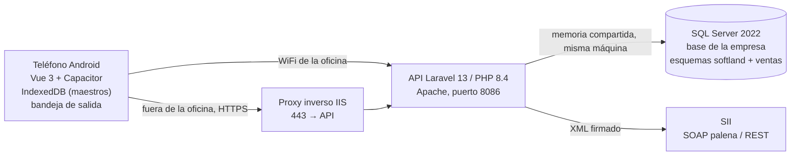

# Informe técnico — Venta Softland y su base de datos

> Qué es la aplicación, qué hace y **exactamente** cómo habla con la base de
> datos de Softland: qué lee, qué escribe, con qué llaves y con qué evidencia
> detrás. Escrito para que se entienda sin tener el repositorio delante.
>
> Medido contra la base de producción de INNOVAGES el 2026-09-26.

## 1. Qué es

Una aplicación **Android** para el ciclo de venta de Softland de punta a punta
—**cotización → nota de venta → factura o boleta electrónica**— pensada para el
vendedor en terreno: instalable, capaz de **trabajar sin señal** y de
sincronizar cuando vuelve la red.

No hay interfaz web. El servidor es sólo una API; la administración se hace
desde la propia app con rol de administrador. Las dos únicas páginas HTML son
`/setup`, que se usa una vez al instalar, y `/app`, de donde se descarga el
instalable — las dos existen porque ocurren **antes** de que la app exista en el
teléfono.

El sistema es **un repositorio y N instalaciones**, no una copia por cliente.
Lo propio de cada empresa vive fuera del código: la conexión, la identidad, las
reglas y los folios.

## 2. Arquitectura física

Lo que hay que retener: **SQL Server no escucha en la red**. Sólo se llega a él
desde dentro del propio servidor. Por eso existe la API — el teléfono nunca
habla con la base — y por eso la conexión no necesita cifrarse: no sale de la
máquina.

El servidor de aplicaciones y el de base de datos son **la misma máquina**, que
es además donde corre el Softland de escritorio.

## 3. Dos esquemas en una sola base

La app no tiene base propia: trabaja **dentro de la base de la empresa**, en un
esquema aparte.

| | `softland` | `ventas` |
|---|---|---|
| Dueño | El ERP | Esta aplicación |
| Contenido | ~1.438 tablas del ERP | 13 tablas y 1 vista |
| Qué guarda | El negocio | Usuarios, tokens, notificaciones, mapas de idempotencia, bitácoras propias |

Tres propiedades que se sostienen a propósito y se pueden comprobar con
`php artisan ventas:huella`:

1. **Ninguna migración hace `ALTER` sobre `softland`.** La app no modifica ni
   una tabla del ERP.
2. **Ninguna clave foránea cruza entre los dos esquemas.** Sin cruces, quitar la
   aplicación es borrar un esquema.
3. **Todo lo que la app escribe en tablas del ERP queda anotado** en su propio
   esquema (`ventas.documento_app`, `ventas.codigo_barras_app`), porque las
   tablas del ERP no guardan autor.

## 4. Qué lee y qué escribe de Softland

### Lectura — los maestros

El catálogo se describe **una sola vez**, en `app/Services/Softland/Maestros.php`:
tabla, clave, mapa de campos y filtro. Un maestro nuevo es un arreglo más, no un
controlador. De ahí salen los 21 maestros que el teléfono baja a IndexedDB
(~14.175 registros, menos de 10 s por WiFi).

| Qué | Tabla |
|---|---|
| Clientes y proveedores (auxiliares) | `cwtauxi` (3.826) |
| Contactos del auxiliar | `cwtaxco` |
| Perfil comercial y de cobranza del cliente | `cwtcvcl` (2.674) |
| Productos | `iw_tprod` (1.195 vendibles) |
| Giros / actividades económicas | `cwtgiro` (2.667) |
| Comunas y ciudades | `cwtcomu`, `cwtciud` |
| Vendedores | `cwtauxven`, `wisusuarios` |
| Tipos de compromiso de seguimiento | `nwttcomp` |
| Parámetros de la empresa | `iwparam`, `nwparam`, `soempre` |
| Permisos | `wisrestperfil` (4.770) + `wisrestusuario` (2.464) vía `wisperfilusuario` |
| Atributos declarados por la empresa | `…TVAtr`, `…TVAtrT/F/V` |

Dos detalles que cuestan caro si se ignoran: **los permisos se conceden en dos
sitios que se suman** (perfil y usuario), y un usuario puede tener varios
perfiles del mismo sistema — preguntar por uno solo le dice «no» a quien sí
puede. Y **los atributos no se nombran en el código**: se dibuja lo que declare
la base, porque cada empresa declara los suyos.

### Escritura — el flujo de venta

| Documento | Tablas | Correlativo |
|---|---|---|
| Cotización | `nwcotiza` (2.356) + `nwdetcot` (9.603) | `CotNum` = `MAX + 1` |
| Seguimiento / compromiso | `nwtsegui` | — |
| Nota de venta | `nw_nventa` (804) + `nw_detnv` | `NVNumero` = `MAX + 1` |
| Factura, boleta, nota de crédito | `iw_gsaen` (214) + `iw_gmovi` (215) | Folio repartido por el ERP |
| Referencias del DTE | `IW_GSaEn_RefDTE` | — |
| Inventario | `iw_encpicking` | — |
| DTE: cabecera, timbre y XML | `dte_doccab`, `dte_archivos`, `dte_siicaf` | `DTE_pdblEntregaFolioDTE` |
| Código de barras aprendido | `iw_tprod.CodBarra` — **la única columna que la app escribe de un maestro** | — |

### Las reglas duras de esa escritura

- **El correlativo se calcula.** `CotNum` y `NVNumero` no son `IDENTITY` y la
  base no tiene tabla de correlativos: se toma el máximo bajo `UPDLOCK, HOLDLOCK`
  dentro de la transacción, con reintento ante choque de clave primaria.
- **El folio del DTE lo reparte el ERP**, con su propio procedimiento. No se
  calcula por cuenta propia, y un folio gastado no se devuelve.
- **La idempotencia va por `client_uuid`**, no por clave natural: el número lo
  pone el servidor. El mapa está en `ventas.documento_app`, y lleva `creado_en`
  además del número — un número no identifica un documento para siempre, porque
  al borrar, el correlativo `MAX + 1` reparte ese número otra vez.
- **Un documento sin vendedor no existe para Softland**: no sale en sus ventanas
  de búsqueda. `VenCod` nunca va en nulo.
- **Quien crea el documento va en `UsuarioGeneraDocto`** y `Usuario` se deja
  vacío. Es al revés de lo que parece, y es como lo escribe el ERP.
- **Los estados son los cuatro que admite el ERP**: `P` pendiente, `A` aprobada,
  `C` concluida, `N` **nula** — no «nueva».
- **El saldo se calcula, no se guarda.** Es una resta sobre los documentos que
  existen ahora. Las siete columnas de avance de `nw_detnv` están muertas y se
  dejan en cero, como las deja el ERP.
- **Anular y eliminar no son lo mismo.** Anular es `N` y conserva el número;
  eliminar borra la fila y devuelve el número al pozo. Lo entregado al cliente
  se anula, nunca se borra.
- **Toda consulta va parametrizada.** Sin excepción.

### El enlace entre documentos

Dos saltos, dos enlaces, y sólo uno es nuestro:

- **Cotización → nota de venta**: `ventas.linea_origen`, tabla propia.
- **Nota de venta → factura**: `iw_gmovi.nvCorrela` → `nw_detnv.nvLinea`, que ya
  es de Softland. Usar el suyo hace que el saldo salga bien también cuando
  factura el Softland de escritorio.

## 5. El documento tributario electrónico

- **Emitir y enviar son un solo acto**: la app escribe el documento y lo manda al
  SII en la misma petición. Separarlos hacía que la factura del día 30 se
  emitiera el 2, en otro mes tributario.
- **El teléfono nunca elige un folio.** Lo que queda en la bandeja de salida sin
  señal es una **intención**, sin folio y sin timbre. Por eso dos teléfonos sin
  red no pueden chocar.
- **El timbre se guarda antes de enviar y no se regenera nunca.** Lleva dentro la
  hora en que se timbró, y el código de barras del papel tiene que decir
  exactamente lo mismo que el XML que recibió el SII.
- **Todo el DTE va en ISO-8859-1 y la base guarda caracteres.** Son dos cosas
  distintas, y la frontera está en un solo sitio. `dte_archivos.Archivo` es
  `ntext`, y el controlador ODBC traduce a UCS-2 dando por hecho UTF-8: un byte
  alto suelto **rechaza la escritura entera**.
- **La firma cubre los bytes, no el árbol XML.** De ahí que el generador
  concatene en vez de serializar.

## 6. Dónde para la app — la frontera

**La aplicación llega hasta inventario y facturación, con el DTE emitido, y
para ahí.** No escribe ni una columna `Cpb*` ni `Contab*`.

La **centralización** —contabilidad, registro de ventas y cuenta corriente del
cliente— es un procedimiento aparte que se corre desde Softland, habitualmente a
diario. Sólo cuando un documento se centraliza aparece en la cuenta corriente, y
sólo entonces es cobrable. Está medido: la centralización de INNOVAGES está al
día, con movimientos hasta el folio 239.

Lo que queda al otro lado de esa frontera, y hoy la app no toca:

| Qué | Tabla | Filas |
|---|---|---|
| Comprobantes contables | `cwcpbte` | 407 |
| Movimientos (incluye la cuenta corriente) | `cwmovim` | 1.286 |
| Bitácora de centralización | `iw_logcontab` | 234 |
| Plan de cuentas | `cwpctas` | 174 |
| Formas de pago, con su cuenta contable | `xwtfpago` | 5 |
| Bitácora de cobranza del ERP | `xwcobranza` | **0** |
| Arqueo de caja | `xwarqueo` | **0** |

El módulo de tesorería y cobranza del ERP (`xw*`) tiene poblados sus maestros
—bancos, formas de pago, estados— y **vacías todas sus tablas de movimiento**:
existe y no se usa.

La cuenta corriente del cliente es la cuenta `1-01-03-001` del plan, con 432
movimientos y un saldo de 4.391.820 repartido entre 6 clientes. El detalle está
en `docs/cobranzas-consulta.md`.

## 7. Cómo opera

- **Sin señal**: los maestros viven en IndexedDB; lo que se escribe sin red va a
  una **bandeja de salida** y sale solo al volver la red. Lo incremental se mide
  con el **reloj del servidor**, nunca con el del aparato.
- **Alcance**: una ventana de 12 meses —que es equipaje y se puede levantar— y un
  alcance por vendedor —que es permiso y no se levanta nunca—.
- **Despliegue**: el código se escribe en el repositorio; PHP y artisan corren en
  el servidor, que es la única máquina con acceso a SQL Server; la SPA y el APK
  se compilan aparte. Un servidor se actualiza solo desde GitHub Releases,
  siempre mandado por una persona.

## 8. Evidencia

Nada de lo anterior es una intención de diseño: está contrastado contra la base
real de la empresa.

| Qué se comprobó | Contra cuánto |
|---|---|
| La aritmética de los totales, reproducida | 200 cotizaciones reales |
| La escritura en inventario, columna por columna | 199 documentos |
| El timbre electrónico, byte a byte | 615 documentos emitidos |
| El XML del DTE, regenerado y firmado idéntico | 209 documentos que el SII aceptó |
| El sobre de envío, reproducido igual | 210 envíos guardados |
| La herencia del vendedor en factura y nota de crédito | 181 de 204 y 12 de 12 |
| Que los disparadores del ERP no se enteran del código de barras | los 18 que propagan cambios |

## 9. Límites conocidos

- **Falta el primer envío de verdad al SII.** Todo lo anterior está reproducido
  contra documentos ya aceptados; el envío es lo único que no se deshace.
- **La boleta está preparada y probada pero bloqueada**: no hay folios CAF de
  boleta a nombre de la empresa.
- **No hay metas en Softland.** Ninguna tabla. La meta es un dato de la app.
- **La cobranza no está implementada.** Es la frontera del punto 6.
